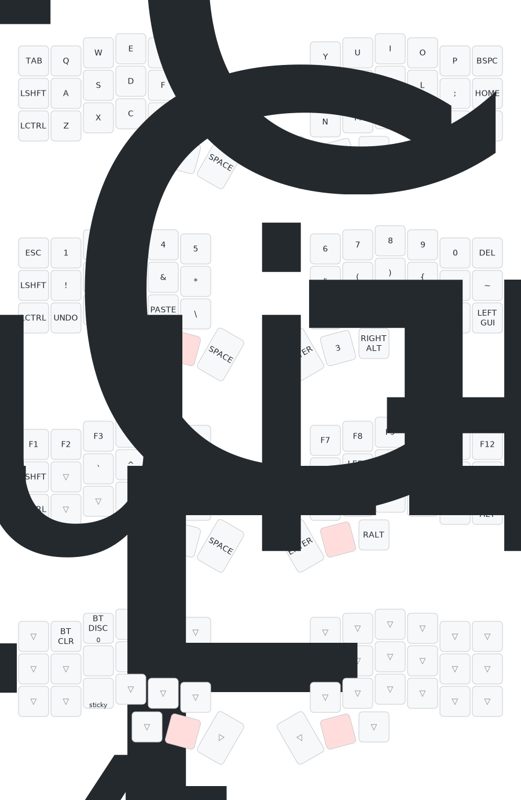

# My CRKBD Wireless
My personal firmware configuration for my crkbd wireless keyboard.
It's a Corne Light v2 Low Edition, made wireless using a cheaper Nice!Nano clone and a 3,7V 750mAh battery.
More information can be found [here](https://github.com/foostan/crkbd/tree/v3-final).

## Configuration Process
- Push new changes to GitHub
- Go to Actions and download new firmware
- Flash new firmware to each Nice!Nano
- Test if every switch works [here](https://config.qmk.fm/#/test).

## Layout Lookup
When trying to learn new layouts on your keyboard it can be helpful to have a visualization of your keymap in order to find specific characters.

- Create a visualization of your keymap [here](https://keymap-drawer.streamlit.app/).
- Export and download as SVG or PNG.

## Layout Change
Edit the ZMK Keymap config on a GUI [here](https://nickcoutsos.github.io/keymap-editor/).
[Cheatsheet](https://peccu.github.io/zmk-cheat-sheet/).
